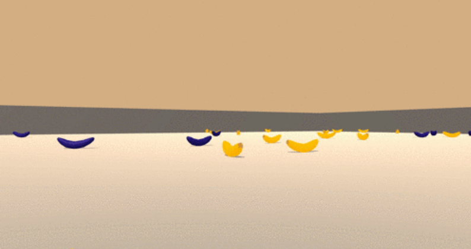
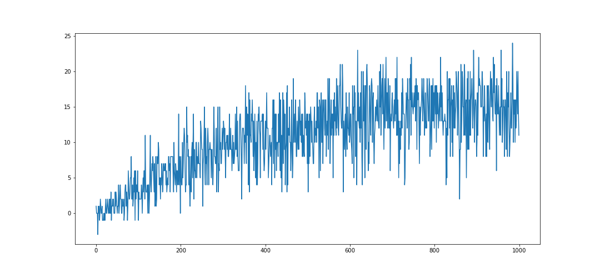

# Navigation

This assignment aims at training an agent that navigates a square world in the Unity framework, collecting yellow bananas while avoiding blue bananas. Training will happen using a reinforcement learning technique that uses deep learning to learn agent policies.

## The Problem

In this simulation, the agent's task is to search for yellow bananas while avoiding blue bananas. As such, the environment will return rewards of `1` for a yellow banana, `-1` for a blue banana and `0` otherwise.

Here's how the simulation looks like:



### State Space

The state space for the banana environment has `37` dimensions in total. These are `floats` representing speed and a representations of what is in the agent's line of sight. (Further details on the state description can be found in [2]).

One example of a state space retrieved from the banana environment as a `numpy` array:

```
[ 1.          0.          0.          0.          0.84408134  0.          0.
  1.          0.          0.0748472   0.          1.          0.          0.
  0.25755     1.          0.          0.          0.          0.74177343
  0.          1.          0.          0.          0.25854847  0.          0.
  1.          0.          0.09355672  0.          1.          0.          0.
  0.31969345  0.          0.        ]
```


### Action Space

At each time step, it has `4` actions at its disposal:
- `0` - walk forward 
- `1` - walk backward
- `2` - turn left
- `3` - turn right


## Solution

The solution uses Deep Queue Networks, as discussed on [1], deep learning can be used as a mechanism for approximating optimal policies for a RL agent.

In particular, the paper discusses the following improvements that helped stabilize learning:
* **Experience Replay** - Randomly sampling from a cache of recent experiences to break correlation on the sequence of observations.
* Use of two networks (target and online), where the online network is updated periodically with weights from the learned off-policy network.

### Network

The DQN network is a 2-layer dense network with `64` units in each layer, using **ReLU** as the activation function.

### Hyper Parameters
We started the experiment using hyper parameters recommended in [1], and the default implementation of the Udacity _Lunar Lander_ lesson. In this notebook we also performed experimentation on some of the crucial hyper parameters related to the DQN paper, namely: replay memory size, and the update frequency. We also experimented with the value of `TAU` (factor for the weight soft-update).

Our final hyper parameters are shown below:

  | Parameter.                          | Value | Origin |
  | ----------------------------------- | ----- | -------|
  | Replay buffer size                  | 25000 | Experimentation |
  | Learning rate                       | 0.00025  | DQN paper [1] |
  | Update interval                     | 4     | Lunar Lander defaults |
  | Mini batch size                     | 64    | DQN paper [1] |
  | $\gamma$ (discount factor)          | 0.99  | DQN paper [1] |
  | $\tau$ (soft update factor)         | 0.01  | Experimentation |
  | Number of episodes                  | 1000   | Experimentation |
  | Max steps per episode               | 500  | Experimentation |
  | Initial $\epsilon$                  | 1.0   | DQN paper [1] |
  | Lower $\epsilon$                    | 0.1   | DQN paper [1] |
  | $\epsilon$ decay                    | 0.995 | Lunar Lander defaults |

## Results




## Setup

### Pre Requisites
**Instructions for Local Run**
(should be already met when run from a Udacity env)

* `pip install unityagents`
* Download the Banana unity app from: https://s3-us-west-1.amazonaws.com/udacity-drlnd/P1/Banana/Banana.app.zip
* Unzip into local directory where notebook is.

### Project Files

This repo contains the following files under the `p1_navigation` directory:

```
P1_Navigation.ipynb    - notebook containing the entire code of the assignment.
banana_final_model.bin - model weights

README.md              - this file.
agent-trend-final.png  - supporting chart
banana-example.png     - supporting image
replay_sizes.csv       - scores for replay size experiment
replay_tau.csv         - scores for tau experiment
replay_update_freq.csv - scores for update frequency experiment
```

### Running the Project

* `git clone` this repository.
* download the Banana Unity app into the same directory as the jupyter notebook (`<ROOT>/p1_navigation`) (https://s3-us-west-1.amazonaws.com/udacity-drlnd/P1/Banana/Banana.app.zip)
* run the jupyter notebook.

## References

[1] - "Human-level control through deep reinforcement learning" - Mnih et al, Feb/2015 (Nature) - https://storage.googleapis.com/deepmind-media/dqn/DQNNaturePaper.pdf

[2] - Note on state description:  https://github.com/Unity-Technologies/ml-agents/issues/1134

