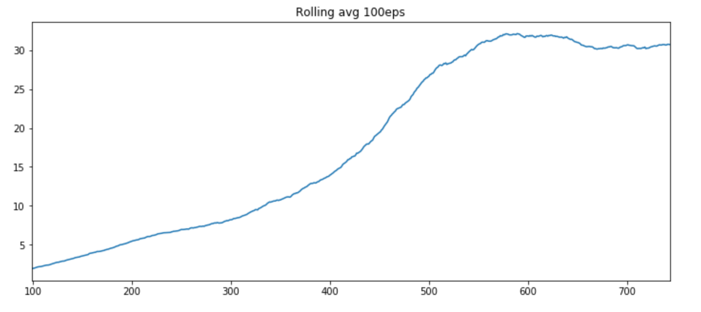

# Continuous Control Assignment

---

## The Problem

The goal of this assignment is to train a multi-jointed robotic arm to follow a target location, using Unity's [Reacher](https://github.com/Unity-Technologies/ml-agents/blob/master/docs/Learning-Environment-Examples.md#reacher) environment. 


* Observations comprise 33-dimensional continous values corresponding to arm's  corresponding to position, rotation, velocity, and angular velocities of the arm.
* Each _action_ is a vector with four numbers, corresponding to torque applicable to two joints. Of particular importance to this problem, the action vector is a _continously-valued_ number between -1 and 1.

## Approach

We will solve **Option 1** of the assignment -  a single agent soluition - using the DDPG [1] Algorithm.

The full implementation is in this notebook and comprises the following components:
* The `Actor` - a feed forward deep network with 2 hidden layers model learning a policy for the environment.
* The `Critic` - a second deep networkwith 2 hidden layers learning an estimate of the expected reqard for an action.
* A `Replay Buffer` class, maintaining a cache of recently-observed experiences and used during learning.
* The `OUNoise` class implementing a Ornstein-Uhlenbeck noise process, used to perturb actions for agent exploration.


### Implementation Notes

We use deep feed forward networks with 2 hidden layers for both actor and critic. The number of nodes in each layer is detailed in the hyper parameters section.

As per implementation notes in [1]:

```
Actions were not included until the 2nd hidden layer of Q (critic)
```

In this implementation, actions are concatenated into the second layer directly from the input layer.


In the next section, we discuss DDPG in more details:

### DDPG

The DDPG algorithm is a model-free, off-policy gradient based reinforcement learning algorithm where two deep learning networks are employed:
* The `actor` network learns a policy from states.
* The `critic` network learns an estimate of the value-function of a state-action pair. The critic estimates are used to guide the learning of the `actor`.

Because learning is off-policy, the above networks are duplicated as local and target. DDPG uses a "soft-update" method to update the target network, which is a weighted update of the network weights where the local network weights contribute by a factor `TAU`, while the target network contributes with `1-TAU`.

As with other deep RL methods, DDPG makes use of a replay buffer. 

In addition, in [1] the authors propose the use of a noise process that takes into consideration past values, as these are better suited for the simulation of physical systems. The Ornstein-Uhlenbeck process is implemented to provide randomness for agent exploration. A brief discussion on how this process works can be found in [3].


## Solution

Considerable research (and _many_ hours of GPU time) were devoted to hyperparameter tuning of this approach. the main references used during the tuning process were:
* Implementation notes from [1], which provided the baseline hyper parameters for experimentation.
* Discussions on this assignment and mentor feedback on Udacity forums. 


The final parameters used in this submission were:

```python
BUFFER_SIZE = 100000   # replay buffer size
BATCH_SIZE = 32        # minibatch size
GAMMA = 0.99           # discount factor
TAU = 0.001            # for soft update of target parameters
LR_ACTOR = 0.0001      # learning rate of the actor 
LR_CRITIC = 0.0001     # learning rate of the critic
WEIGHT_DECAY = 0       # L2 weight decay

N_EPS = 2000           # max. number of episodes in training
MAX_T = 1000           # max number of time steps in each episode

UPDATE_EVERY = 20       # num of timesteps to run learning
LEARN_ROUNDS = 10       # repeat learning (sample from memory + backprop) this many times 

LAYER1_NODES=300        # number of nodes in hidden layer 1   
LAYER2_NODES=300        # number of nodes in hidden layer 2

NOISE_THETA=0.15        # Theta value for OU noise process
NOISE_SIGMA=0.15        # Sigma value for OU noise process

BATCH_NORM = True       # Use batch norm on Critic
STOP_AT = 30.0          # Stop training when mean score is above this value

SEED = 13               # random seed 
```

Some learnings and observations:
* **Replay buffer size** - The replay buffer should be large and a function of the max number of time steps in each experiment episode - too small a buffer would cause DDPG not to learn at all.
* **Batch size, Learning Rates and Tau** - This implementation was sensitive to learning and upates rates. Best results were obtained with "slow" learning rates and relatively small batch sizes. Larger values tended to produce lower or unstable scores.
* Finally, **Batch normalization** on the critic network was quite useful in stabilizing training.

Here's the trend (100-episode moving average) for the trained network:




## Further Work

* One clear direction for future work is the implementation of other model-free methods appropriate for continous valued actions, such as the ones benchmarked in [2], or the ones seen in this module: REINFORCE and PPO.
* Extend this experiment to be robust to the effects of random seed, as proposed in [2].
* Prioritized Experience Replay [4] - Instead of uniformily sampling experiences from the replay buffer for learning, keep track of the "most important" ones (using the calculated TD error as a proxy) to prioritize sampling.

# Instructions

1. `git clone` this repo: https://github.com/bohana/udacity-deep-rl.git
1. `pip install` the following packages: `numpy`, `matplotlib`, `pandas`, `pytorch`, `unityagents (0.4.0)`
1. Download the Reacher environment per project instructions (I used the Linux version found [here](https://s3-us-west-1.amazonaws.com/udacity-drlnd/P2/Reacher/one_agent/Reacher_Linux.zip)), and unzip it in the repo's `p2_control` directory.
1. Run this notebook.

## Project Files

This repo contains the following files under the `p2_control` directory:

```
P1_Continous_Control.ipynb    - notebook containing the entire code of the assignment.
checkpoint_actor.pth          - pytorch model for the actor
checkpoint_critic.pth         - pytorch model for the critic
README.md                     - this file.
```

# References

[1] - Continous Control with Deep Reinforcement Learning (Lilicrap et al 2015) https://arxiv.org/pdf/1509.02971.pdf

[2] - Benchmarking Deep Reinforcement Learning for Continuous Control (Duan et al 2016) https://arxiv.org/pdf/1604.06778.pdf

[3] - https://www.quora.com/Why-do-we-use-the-Ornstein-Uhlenbeck-Process-in-the-exploration-of-DDPG

[4] - Prioritized experience replay - https://arxiv.org/abs/1511.05952
