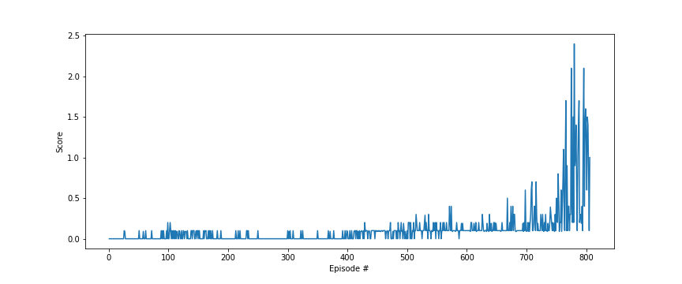
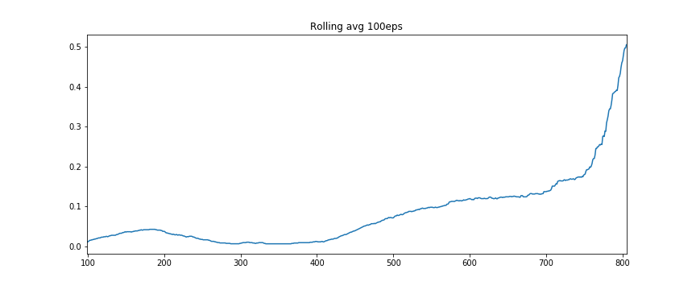

# Collaboration and Competition - Project

---

# Introduction

This assignment performs multi-agent reinforcement learning on the Unity **Tennis** envitonment. In this environment two agents control rackets to bounce a ball over a net. If an agent hits the ball over the net, it receives a reward of `+0.1`.  If an agent lets a ball hit the ground or hits the ball out of bounds, it receives a reward of `-0.01`. 

The observation space consists of 8 variables corresponding to the position and velocity of the ball and racket. Two continuous actions are available, corresponding to movement toward (or away from) the net, and jumping. 

In order to solve the environment, the agents must get an average score of `+0.5` over 100 consecutive episodes, after taking the maximum over both agents.


# Implementation

This project implements a version of the `MADDPG` algorithm described in [1], which itself is a modification of `DDPG` [2] for multi-agent scenarios. 

The DDPG algorithm is a model-free, off-policy gradient based reinforcement learning algorithm where two deep learning networks are employed:
* The `actor` network learns a policy from states.
* The `critic` network learns an estimate of the value-function of a state-action pair. The critic estimates are used to guide the learning of the `actor`.

Because learning is off-policy, the above networks are duplicated as local and target. DDPG uses a "soft-update" method to update the target network, which is a weighted update of the network weights where the local network weights contribute by a factor `TAU`, while the target network contributes with `1-TAU`.

As with other deep RL methods, DDPG makes use of a replay buffer. 

## MADDPG

In this project I modify the `DDPG` implementation of the previous P2 assignment in order to satisfy the assumptions of `MADDPG`:
* agents can share information while training their respective policies.
* however at runtime, each agent acts independently, without knowledge of each other.

To that end, during training each agent has access to a **shared** replay buffer, and learn their parameters independently from one another.

## Hyper Parameters

```python
BUFFER_SIZE = 100000    # replay buffer size
BATCH_SIZE = 256        # minibatch size
GAMMA = 0.9             # discount factor
TAU = 0.001             # for soft update of target parameters
LR_ACTOR = 0.001        # learning rate of the actor 
LR_CRITIC = 0.001       # learning rate of the critic
WEIGHT_DECAY = 0        # L2 weight decay

N_EPS = 10000           # how many episodes
MAX_T = 1000            # max time steps in each episode

UPDATE_EVERY = 1        # num of timesteps to run learning
LEARN_ROUNDS = 1        # repeat learning (sample from memory + backprop) this many times 

LAYER1_NODES=128        # hidden layer 1 - # units 
LAYER2_NODES=64         # hidden layer 2 - # units

NOISE_THETA=0.1         # theta parameter in OU noise process
NOISE_SIGMA=0.1         # sigma parameter in OU noise process

BATCH_NORM = True       # use batch normalization in critic
STOP_AT = 0.5           # stop training when rolling mean score reaches this value 

NUM_AGENTS = 2

SEED = 13
```

## Observations

While in past experiments it was useful to tune the frequency (in steps) and number of learn updates to influence the speed of learning, this experiment agrees with [4] in that the most expedient training regime was to run backprop on once for each agent at every time step. Thus we set our hyper parameters to:

```
UPDATE_EVERY = 1        # num of timesteps to run learning
LEARN_ROUNDS = 1        # repeat learning (sample from memory + backprop) this many times 
```

We also found that learning was quite sensitive to parameters used in the noise process. The values below eventually stabilised learning, although others may provbide better results:

```
NOISE_THETA=0.1         # theta parameter in OU noise process
NOISE_SIGMA=0.1         # sigma parameter in OU noise process
```

In our implementation the solution converged in about 800 episodes:

```
Episode 0	Average of Max Scores: 0.000 Mean episode len: 14.00; Sum score: 0.00
Episode 100	Average of Max Scores: 0.012 Mean episode len: 16.85; Sum score: 1.18
Episode 200	Average of Max Scores: 0.038 Mean episode len: 22.20; Sum score: 3.81
Episode 300	Average of Max Scores: 0.008 Mean episode len: 16.01; Sum score: 0.80
Episode 400	Average of Max Scores: 0.013 Mean episode len: 16.76; Sum score: 1.27
Episode 500	Average of Max Scores: 0.072 Mean episode len: 30.45; Sum score: 7.18
Episode 600	Average of Max Scores: 0.120 Mean episode len: 48.78; Sum score: 12.01
Episode 700	Average of Max Scores: 0.137 Mean episode len: 53.91; Sum score: 13.73
Episode 800	Average of Max Scores: 0.465 Mean episode len: 179.43; Sum score: 46.46
Episode 805	Average of Max Scores: 0.505
```



Smoothed out version indicating 100-eps rolling mean:



## Further Work

There are other opportunities for improvement described in the `MADDPG` paper, namely:
* The use of information from both agents while training the critic network.
* Implement agents with policy ensembles.

In addition, a more systematic hyper parameter tuning may yield posiitve results, as well as the application of other RL methods for continous spaces, like the ones benchmarked in [3].


# Instructions

1. `git clone` this repo: https://github.com/bohana/udacity-deep-rl.git
1. `pip install` the following packages: `numpy`, `matplotlib`, `pandas`, `pytorch`, `unityagents (0.4.0)`
1. Download the Unity `Tennis` environment per project instructions (I used the Linux version found [here](https://s3-us-west-1.amazonaws.com/udacity-drlnd/P3/Tennis/Tennis_Linux.zip)), and unzip it in the repo's `p3_collab-compet` directory.
1. Run this notebook.

## Project Files

This repo contains the following files under the `p2_control` directory:

```
P3_Collab_Compete_Tennis.ipynb  - notebook with entire project implementation
checkpoint_ag0_actor.pth        - actor network params - agent 1 
checkpoint_ag0_critic.pth       - cricit network params - agent 1 
checkpoint_ag1_actor.pth        - actor network params - agent 2
checkpoint_ag1_critic.pth       - critic network params - agent 2
README.md                       - this file.
```


# References

[1] - Multi-Agent Actor-Critic for Mixed Cooperative-Competitive Environments (Lowe et al 2017) - https://papers.nips.cc/paper/7217-multi-agent-actor-critic-for-mixed-cooperative-competitive-environments.pdf

[2] - Continous Control with Deep Reinforcement Learning (Lilicrap et al 2015) https://arxiv.org/pdf/1509.02971.pdf

[3] - Benchmarking Deep Reinforcement Learning for Continuous Control (Duan et al 2016) https://arxiv.org/pdf/1604.06778.pdf

[4] - https://towardsdatascience.com/training-two-agents-to-play-tennis-8285ebfaec5f